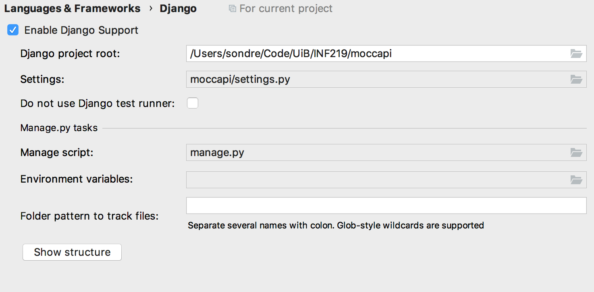

# `moccapi`

Repository containing the API server.

# PyCharm w/Django

To configure everything so that stuff works properly, do the following: 

1. Open preferences
2. Go to `Languages and frameworks`
3. Select Django
4. Configure the settings according to the image below
5. ???
6. Profit

To run the Django application, once you've configured it all you need to do is
select the `Configuration` button in the top right, select `Edit
configurations`, press the `+` sign in the upper left corner, select `Django
Server` and press `OK`. 

# Code quality

To ensure that the code meets some standard of quality, we're using Flake8,
Black and isort to maintain a consistent standard. For development, to ensure
that everything is up to date, run the following commands:

- `black .` to format all Python code.
- `isort --recursive .` to sort imports.
- `flake8` to check for style warnings, errors etc.
- `python manage.py test` to run tests.

# Running

To begin with, you need to make all the migrations. From PyCharm, open the
`manage.py` console from Tools, run `makemigrations` and then `migrate`. Now you
can start the application and go to `localhost:8000` to view it. For a view of
the Swagger documentation go to `localhost:8000/swagger/`.

If you require test data, run `loaddata api` in the `manage.py` console.

# Docker

Build with `docker build -t moccapi .` and run with `docker run -itd -p
5432:5432 --rm --name moccapi moccapi`
